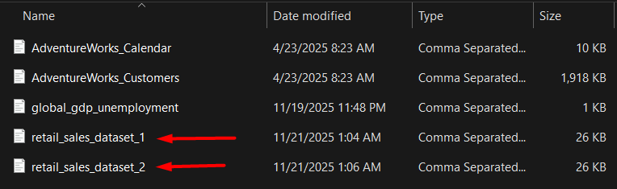

## **ADF Based OnPrem to Cloud Migration Pipeline**
 

### **Overview**
This project demonstrates a complete enterprise-grade data engineering solution built using Azure Data Factory, Azure SQL Database, Azure Synapse Analytics, and Power BI.

- The pipeline first moves the sales CSV files from on-premises storage to cloud and loads it into Azure SQL Database.
- From Azure SQL Database, only new records are extracted and saved as Parquet files in a staging folder.
- The staged data is then transformed and modelled into fact and dimension tables, which are stored in Azure Synapse Dedicated SQL Pool.
- A Power BI dashboard is created on top of the Synapse tables to show sales insights and visual reports.
- A scheduled trigger is created to run the entire pipeline automatically every month.
- Alerts are set up to notify the user immediately whenever a pipeline failure occurs.

 

### **Tech Stack**
Azure Data Factory, Azure Data Lake Storage Gen2, Azure SQL Database, Azure Synapse Analytics, Power BI
- Activities Used in ADF - Get Metadata, ForEach, If Condition, Copy, Delete, Lookup, Execute Pipeline

### **Description**

1. OnPrem → Cloud Ingestion 
   The OnPrem to Cloud Ingestion pipeline is responsible for moving the sales CSV files from on-premises environment to cloud. It uses a Self-Hosted Integration Runtime to securely access the on-prem file system.
   
   

   **Activities Used :-**
   - Get Metadata - The Get Metadata activity retrieves the list of files stored in on-premises folder.
   - ForEach - The ForEach activity loops through each file returned by Get Metadata.
   - If Condition - The If Condition activity checks whether the current file name starts with “retail_sales”. It allows the pipeline to process only the required sales files and ignore unrelated files.
   - Copy Data (inside the True block) - If the condition is true, copy activity copies the current file from on-prem folder into Azure SQL Database.
   - Delete (inside the True block) - After the file is successfully copied, the Delete activity removes the file from the on-premises location. This prevents reprocessing of the same file in future runs.

       

     
   
   

